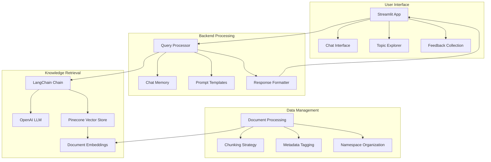

# AMO Events Knowledge Base

A comprehensive knowledge base system for the AMO Events Platform, built with LangChain, Pinecone, and Streamlit.

## Overview

The AMO Events Knowledge Base provides information about event management using Webflow, Airtable, Xano, n8n, and WhatsApp API. It uses semantic search to retrieve relevant information from a knowledge base of documentation and guides.

## Features

- Natural language query interface
- Domain-specific query expansion and reformulation
- Multi-turn conversation support
- Source attribution for all answers
- Export conversations in CSV or JSON format
- Accessibility features (high contrast, text resizing)
- Topic-based filtering
- Automated content management system
- Docker deployment support

## Directory Structure

```
amo-base/
├── assets/                  # Static assets (logos, images)
├── config/                  # Configuration files
│   └── update_schedule.yaml # Content update schedule config
├── docs/                    # Documentation
│   ├── deployment_guide.md        # Deployment instructions
│   ├── prompt_engineering.md      # Prompt engineering strategies
│   ├── complete-mermaid-ai-guide.md # Mermaid diagram guide
│   ├── prd.md                     # Product requirements document
│   └── markdown_results.zip       # Exported documentation archive
├── logs/                    # Application logs
├── tests/                   # Test files
│   ├── test_multi_turn_chat.py # Test for multi-turn conversations
│   ├── test_query.py           # Test for query processing
│   ├── test_direct_pinecone.py # Test for Pinecone interactions
│   ├── test_namespace_query.py # Test for namespace querying
│   ├── test_pinecone.py        # Basic Pinecone connection test
│   └── test_pinecone_integration.py # Test for Pinecone integration
├── tools/                   # Utility tools
│   ├── content_updater.py   # Tool for managing knowledge base content
│   └── schedule_updates.py  # Tool for scheduling content updates
├── utils/                   # Utility modules
│   ├── fallback_prompts.py  # Handling when no info is found
│   ├── logging_system.py    # Logging and analytics
│   ├── prompts.py           # System prompts for the assistant
│   └── query_reformulation.py # Query expansion and decomposition
├── .env.example             # Example environment variables
├── .gitignore               # Git ignore file
├── app.py                   # Web app entry point (Streamlit wrapper)
├── docker-compose.yml       # Docker Compose configuration
├── Dockerfile               # Docker build configuration
├── ingest_documents.py      # Document ingestion script
├── ingest_knowledge.py      # Knowledge processing script
├── knowledge_utils.py       # Knowledge base utilities
├── pinecone_langchain_integration.py # Pinecone integration utilities
├── plan.md                  # Project implementation plan
├── query_knowledge.py       # Core knowledge query processor
├── requirements.txt         # Python dependencies
├── streamlit_app.py         # Main Streamlit app entry point
```

## Core Files

- **streamlit_app.py**: Main application entry point with Streamlit interface
- **query_knowledge.py**: Core engine for processing queries and retrieving information
- **knowledge_utils.py**: Utilities for knowledge base operations
- **ingest_knowledge.py**: Tools for adding content to the knowledge base

## System Architecture

The AMO Events Knowledge Base follows a layered architecture:

1. **Presentation Layer** - Streamlit App
   - `streamlit_app.py`: Main UI with chat interface
   - `app.py`: Alternative entry point

2. **Business Logic Layer** - Query Processing
   - `query_knowledge.py`: Core query processing engine
   - `utils/query_reformulation.py`: Query expansion and improvement
   - `utils/fallback_prompts.py`: Fallback strategies
   - `utils/logging_system.py`: Logging and analytics

3. **Data Access Layer** - Knowledge Retrieval
   - `knowledge_utils.py`: Knowledge base operations
   - `pinecone_langchain_integration.py`: Vector database integration
   - `ingest_knowledge.py`: Knowledge ingestion pipeline

4. **Infrastructure Layer** - Deployment
   - `Dockerfile`: Container configuration
   - `docker-compose.yml`: Multi-container setup
   - `tools/schedule_updates.py`: Maintenance automation

5. **Testing Layer** - Quality Assurance
   - `tests/`: Test suites for different components

### Data Flow

1. User submits query via Streamlit interface
2. Query is reformulated to improve retrieval accuracy
3. Vector similarity search retrieves relevant documents
4. Retrieved documents are used as context for the LLM
5. LLM generates response with source attribution
6. Response is displayed to user with reference links

### System Components



## Setup

1. Clone the repository
2. Create and activate a virtual environment:
   ```
   python -m venv venv
   source venv/bin/activate  # Linux/Mac
   venv\Scripts\activate  # Windows
   ```
3. Install dependencies:
   ```
   pip install -r requirements.txt
   ```
4. Copy `.env.example` to `.env` and fill in your API keys:
   ```
   cp .env.example .env
   ```
5. Run the application:
   ```
   streamlit run streamlit_app.py
   ```

## Docker Deployment

1. Build and start the containers:
   ```
   docker-compose up -d
   ```
2. Access the application at `http://localhost:8501`

## Content Management

Use the content management tools to add or update knowledge base content:

```
# Add new content
python tools/content_updater.py add --path documents/new_docs/ --namespace webflow --topics webflow frontend

# Update existing content
python tools/content_updater.py update --path documents/updated_docs/

# List content
python tools/content_updater.py list --namespace webflow

# Backup the knowledge base
python tools/content_updater.py backup --output backups/kb-backup-$(date +%Y%m%d)
```

## Schedule Automatic Updates

Configure the content update schedule in `config/update_schedule.yaml` and run:

```
python tools/schedule_updates.py --daemon
```

## File Relationships

Key file relationships and dependencies:

- `streamlit_app.py` → imports from `query_knowledge.py` and `utils/logging_system.py`
- `query_knowledge.py` → imports from `knowledge_utils.py`, `utils/query_reformulation.py`, and `utils/fallback_prompts.py`
- `ingest_knowledge.py` → imports from `knowledge_utils.py` and `pinecone_langchain_integration.py`
- `tools/content_updater.py` → imports from `knowledge_utils.py` and `ingest_knowledge.py`
- `tools/schedule_updates.py` → imports from `tools/content_updater.py`

## Contributing

1. Fork the repository
2. Create a new branch: `git checkout -b feature/your-feature-name`
3. Make your changes and commit them: `git commit -m 'Add some feature'`
4. Push to the branch: `git push origin feature/your-feature-name`
5. Submit a pull request

## License

This project is licensed under the MIT License - see the LICENSE file for details.

## Contact

For questions or support, please contact the AMO Events team.

