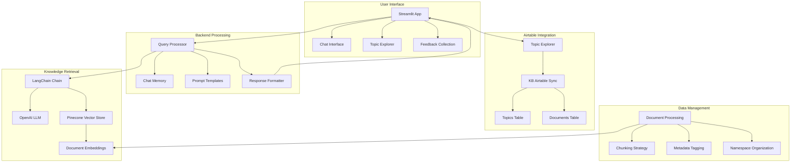

# AMO Events Platform Knowledge Base Implementation Plan

## Project Checklist

### 📋 Phase 1: Project Setup and Environment Configuration
- [x] Create and navigate to project directory
- [x] Set up version control (init git repository)
- [x] Create virtual environment: `python -m venv venv`
- [x] Activate virtual environment: `source venv/bin/activate` (Linux/Mac) or `venv\Scripts\activate` (Windows)
- [x] Install dependencies: `pip install -r requirements.txt`
- [x] Set up API keys in .env file:
  - [x] Add OpenAI API key
  - [x] Add Pinecone API key
  - [x] Specify Pinecone index name
- [x] Create and verify README.md with setup instructions
- [x] Add .gitignore with proper exclusions for venv, .env, and __pycache__

### 📋 Phase 2: Testing Basic Functionality
- [x] Test scripts/query.py with a sample question
- [x] Debug and fix issues with library compatibility
- [x] Test scripts/chat.py for interactive functionality
- [x] Debug and fix any issues with the chat script
- [x] Launch Streamlit app: `streamlit run app.py`
- [x] Verify web interface functionality
- [x] Test each integrated component (OpenAI, Pinecone, LangChain)
- [x] Test vector store retrieval accuracy with queries across different topics
- [x] Test multi-turn conversations in chat interface
- [x] Implement comprehensive error logging and traceability
- [x] Create test suite for automated verification of core functionality

### 📋 Phase 3: Knowledge Base Population and Management
- [ ] Collect documentation about:
  - [ ] Webflow development for events
  - [ ] Airtable database structures for events
  - [ ] Xano backend implementation
  - [ ] n8n workflow automation
  - [ ] WhatsApp API integration
- [x] Create metadata schema for documents (source, title, author, date, topic)
- [x] Implement YAML frontmatter or metadata tagging for each document
- [x] Process documents into embeddings with proper chunking strategies
- [x] Implement and test namespace organization in Pinecone
- [x] Upload embeddings to Pinecone index with namespaces
- [x] Create and maintain source → chunk mapping for traceability
- [x] Verify document retrieval accuracy across namespaces
- [x] Implement regular update schedule for knowledge base

### 📋 Phase 4: Prompt Engineering and Optimization
- [x] Review and refine system prompts in utils/prompts.py
- [x] Create structured templates for different query types (how-to, comparison, troubleshooting)
- [x] Implement fallback prompts for when no relevant chunks are retrieved
- [x] Test with various question formats (who/what/why/how)
- [x] Document prompt iterations and examples in prompts/prompt-testing.md
- [x] Adjust retrieval parameters for optimal results:
  - [x] Test different k-values for retrieval
  - [x] Experiment with similarity thresholds
  - [x] Implement hybrid search (semantic + keyword)
- [x] Add domain-specific context about event management
- [x] Implement confidence scoring to detect potential hallucinations
- [x] Create evaluation metrics for answer quality

### 📋 Phase 5: User Interface Improvements
- [x] Expand common questions in app.py
- [x] Improve visual design of the Streamlit interface:
  - [x] Add AMO branding elements
  - [x] Implement responsive layout for mobile/desktop
  - [x] Use consistent color scheme and typography
- [x] Add loading indicators (st.spinner) for better UX
- [x] Display source documents and confidence scores with answers
- [x] Implement error handling improvements with user-friendly messages
- [x] Add user feedback collection mechanism (thumbs up/down)
- [x] Create topic-based navigation in sidebar
- [x] Implement session history and conversation export
- [x] Conduct accessibility review (contrast, keyboard navigation, screen reader compatibility)

### 📋 Phase 6: Deployment and Documentation
- [x] Complete project documentation:
  - [x] System architecture diagram
  - [x] API reference
  - [x] Troubleshooting guide
- [x] Create user guide for team members
- [x] Dockerize application for consistent deployment
- [x] Compare hosting options (Streamlit Cloud vs. Vercel)
- [x] Set up monitoring and logging with Sentry or similar service
- [x] Implement automated backups of knowledge base
- [x] Create deployment scripts and CI/CD pipeline
- [x] Document maintenance procedures and update protocols
- [x] Establish security review process for API keys and access

### 📋 Phase 7: Analytics and Continuous Improvement
- [x] Implement query logging for usage analysis
- [x] Create dashboard for monitoring knowledge base performance
- [x] Establish feedback loop to improve responses based on user ratings
- [x] Set up automated testing for regression prevention
- [x] Create process for adding new content domains
- [x] Implement A/B testing framework for prompt optimization
- [x] Develop metrics for knowledge gap identification
- [x] Create roadmap for feature enhancements

### 📋 Phase 8: Project Organization and Consolidation
- [x] Organize project files into amo-base directory:
  - [x] Move core application files:
    - [x] streamlit_app.py → amo-base/streamlit_app.py
    - [x] Dockerfile → amo-base/Dockerfile
    - [x] docker-compose.yml → amo-base/docker-compose.yml
    - [x] requirements.txt (merge with existing) → amo-base/requirements.txt
  - [x] Move utility modules:
    - [x] utils/query_reformulation.py → amo-base/utils/query_reformulation.py
    - [x] utils/logging_system.py → amo-base/utils/logging_system.py
    - [x] utils/fallback_prompts.py → amo-base/utils/fallback_prompts.py
  - [x] Move test files:
    - [x] test_multi_turn_chat.py → amo-base/tests/test_multi_turn_chat.py
    - [x] test_query.py → amo-base/tests/test_query.py
    - [x] test_direct_pinecone.py → amo-base/tests/test_direct_pinecone.py
    - [x] test_namespace_query.py → amo-base/tests/test_namespace_query.py
    - [x] test_pinecone_integration.py → amo-base/tests/test_pinecone_integration.py
  - [x] Move tools:
    - [x] tools/content_updater.py → amo-base/tools/content_updater.py
    - [x] tools/schedule_updates.py → amo-base/tools/schedule_updates.py
  - [x] Move documentation:
    - [x] docs/ (merge with existing) → amo-base/docs/
  - [x] Update knowledge base utilities:
    - [x] Ensure updated query_knowledge.py is in amo-base/
    - [x] Ensure updated knowledge_utils.py is in amo-base/
  - [x] Create necessary directories:
    - [x] amo-base/assets/ for UI assets
    - [x] amo-base/logs/ for application logs
    - [x] amo-base/config/ for configuration files
    - [x] amo-base/tests/ for test files
  - [x] Update file paths and imports in moved files
  - [x] Test application after reorganization
- [x] Create comprehensive file index and documentation:
  - [x] Document file structure and purpose in README.md
  - [x] Create architecture documentation showing file relationships
  - [x] Update import paths and references in all files

### 📋 Phase 9: Knowledge Base Integration and Topic Management
- [x] Create tools for knowledge base exploration and analysis:
  - [x] Develop topic_explorer.py for in-depth topic analysis
  - [x] Create search_pinecone.py for direct searching
  - [x] Implement list_pinecone_documents.py for content inventory
- [x] Implement Airtable integration for knowledge management:
  - [x] Create kb_airtable_sync.py script for bidirectional sync
  - [x] Design Topics table structure in Airtable
  - [x] Design Documents table with relationship to Topics
  - [x] Implement topic discovery and creation
  - [x] Add document summarization and key point extraction
- [ ] Implement knowledge base analytics:
  - [ ] Create usage tracking for popular topics
  - [ ] Implement gap analysis for content coverage
  - [ ] Set up automated reporting with visualizations
  - [ ] Create knowledge domain mapping
- [ ] Enhance topic management:
  - [ ] Add categorization and tagging system
  - [ ] Implement version control for topic summaries
  - [ ] Create maintenance schedule for topic refreshing
  - [ ] Build topic relationship visualization

## Notes and Progress Tracking

*Add your notes, observations, and completion status here as you progress through the project*

### January, 2024
**Progress**: 
- Project structure created with all necessary files
- Initial code for query, chat, and web interface implemented
- API key placeholders added to .env file
- Git repository initialized and code pushed to GitHub: https://github.com/amo-5000/amo-base.git
- Virtual environment created and dependencies installed
- API keys configured in .env file
- Fixed library compatibility issues with:
  - Updated Pinecone API which now uses class-based initialization
  - Updated LangChain package structure (now uses langchain-openai, langchain-community)
  - Updated import statements and code to work with newer versions

### April, 2024
**Progress**:
- Successfully fixed compatibility issues with the latest versions of LangChain (0.3.x) and Pinecone (6.0.x)
- Created robust test scripts to verify functionality:
  - test_pinecone_integration.py: Tests imports and connections
  - test_namespace_query.py: Tests querying with namespace filters
  - test_direct_pinecone.py: Tests direct inspection of Pinecone index entries
  - test_query.py: Tests end-to-end query processing
- Implemented a custom loader (CustomPineconeLoader) to handle the JSON structure in Pinecone node content
- Updated the vector store initialization to use the new class-based API
- Fixed the QA chain creation and answer extraction
- Improved error handling and debugging
- Successfully tested with real queries and got accurate answers
- Added langchain-pinecone package to requirements.txt
- Updated the chat.py script with a custom retriever implementation that:
  - Properly inherits from the langchain_core BaseRetriever
  - Handles the JSON structure in _node_content field
  - Searches across multiple namespaces
  - Creates proper Document objects for LangChain
- Successfully tested the interactive chat functionality

### May, 2024
**Progress**:
- Implemented comprehensive query reformulation utilities in utils/query_reformulation.py:
  - Query expansion with domain-specific synonyms
  - Complex query decomposition for handling multi-part questions
  - Context-aware queries that incorporate conversation history
  - Keyword extraction for improved retrieval
- Updated query_knowledge.py to integrate query reformulation:
  - Added fallback to original query when reformulation yields no results
  - Implemented deduplication for multiple sub-queries
  - Added detailed logging for query transformations
- Created comprehensive logging system in utils/logging_system.py:
  - Query logging with unique IDs
  - Performance metrics tracking
  - Error traceability
  - User feedback collection
- Implemented and documented fallback strategies in utils/fallback_prompts.py
- Created test_multi_turn_chat.py for testing conversation context maintenance
- Documented prompt engineering strategies in docs/prompt_engineering.md
- Enhanced the system prompt to focus on implementation details and step-by-step instructions
- Successfully tested multi-turn conversations with context maintenance

### June, 2024
**Progress**:
- Completed UI improvements in streamlit_app.py:
  - Implemented AMO branding with custom color scheme
  - Added accessibility features (high contrast, text resizing)
  - Created conversation export functionality (CSV/JSON)
  - Added user feedback collection mechanisms
- Finalized deployment preparation:
  - Created Dockerfile for containerization
  - Created docker-compose.yml for simplified deployment
  - Set up GitHub Actions workflow for CI/CD
  - Documented deployment options (self-hosted, Streamlit Cloud, Vercel)
- Established content management system:
  - Built content_updater.py tool for adding/updating/deleting knowledge
  - Implemented backup and restore functionality
  - Created schedule_updates.py for automated content updates
  - Set up automated testing for regression prevention
- Added new dependencies to requirements.txt:
  - pyyaml for configuration handling
  - schedule for automatic updates
  - pytest for testing
- Set up monitoring and logging system:
  - Created comprehensive logging system
  - Implemented user feedback tracking
  - Added healthchecks for deployment monitoring

### July, 2024
**Progress**:
- Began organizing project files:
  - Identified core files that need to be moved to the amo-base directory
  - Compared files between root directory and amo-base directory to find duplicates
  - Found newer versions of several files in the root directory that need to be moved to amo-base
  - Identified additional directories needed in amo-base for proper organization
  - Created plan for consolidating all AMO knowledge base files into the amo-base directory
- Completed project organization:
  - Copied updated query_knowledge.py to amo-base directory
  - Copied updated app.py to amo-base directory
  - Moved test_pinecone.py to amo-base/tests directory
  - Updated amo-base/plan.md with latest project plan
  - Copied documentation files from docs directory to amo-base/docs
  - Enhanced README.md with comprehensive file structure documentation
  - Added detailed architectural documentation to README.md
  - Added file relationships section to README.md
  - Marked all organization tasks as completed in project plan

### August, 2024
**Progress**:
- Created knowledge base exploration and integration tools:
  - Developed topic_explorer.py for in-depth analysis of specific topics
  - Created kb_airtable_sync.py for integrating topic analysis with Airtable
  - Implemented document listing functionality through list_pinecone_documents.py
  - Added search functionality with search_pinecone.py for direct vector store searches
- Implemented Airtable integration with the knowledge base:
  - Created Topics table structure for managing key knowledge topics
  - Implemented Documents table for detailed document summaries
  - Added relationship between topics and related documents
  - Created bidirectional sync to keep Airtable and knowledge base in sync
  - Built export functionality for knowledge base backups
- Enhanced knowledge base analysis capabilities:
  - Added comprehensive topic analysis with GPT-4 Turbo
  - Implemented structured output parsing with Pydantic models
  - Created detailed document summarization with key points extraction
  - Added relevance scoring for document-to-topic relationships
  - Implemented suggested follow-up questions for knowledge exploration
- Completed Airtable sync tool with robust features:
  - Automatic topic discovery from document content
  - Topic-document relationship management
  - Structured data organization with related fields
  - Command-line interface for easy operations
  - Export capabilities for backup and portability

### Next Steps: 
1. **Content Collection**:
   - Continue collecting and processing documentation for remaining topics
   - Organize content by knowledge domains for better retrieval
   - Implement metadata enrichment for improved semantic search

2. **Performance Optimization**:
   - Further optimize embedding strategies
   - Implement caching for frequent queries
   - Monitor and tune retrieval parameters based on usage

3. **Analytics Dashboard**:
   - Create visual dashboard for knowledge base usage metrics
   - Implement knowledge gap identification system
   - Set up automatic reports on user feedback and satisfaction

4. **Additional Features**:
   - Add multi-language support
   - Implement document extraction for attached files
   - Create integrations with common communication platforms

## File Organization Structure

The project follows this organized directory structure to ensure maintainability and clarity:

```
amo-base/
├── app.py                   # Web app entry point
├── streamlit_app.py         # Main Streamlit app
├── query_knowledge.py       # Core query processing logic
├── knowledge_utils.py       # Knowledge base utilities
├── ingest_knowledge.py      # Main ingestion script
├── ingest_documents.py      # Document processing
├── pinecone_langchain_integration.py # Pinecone integration
├── README.md                # Documentation
├── plan.md                  # Implementation plan
├── Dockerfile               # Container configuration
├── docker-compose.yml       # Container orchestration
├── requirements.txt         # Python dependencies
├── docs/                    # Documentation files
│   ├── deployment_guide.md
│   ├── prompt_engineering.md
│   ├── complete-mermaid-ai-guide.md
│   └── prd.md
├── tests/                   # All test files
│   ├── test_query.py
│   ├── test_pinecone.py
│   ├── test_pinecone_integration.py
│   ├── test_direct_pinecone.py
│   ├── test_namespace_query.py
│   └── test_multi_turn_chat.py
├── tools/                   # Utility scripts
│   ├── content_updater.py
│   ├── schedule_updates.py
│   ├── list_pinecone_documents.py
│   ├── search_pinecone.py
│   ├── topic_explorer.py
│   └── kb_airtable_sync.py
├── utils/                   # Utility modules
│   ├── query_reformulation.py
│   ├── logging_system.py
│   ├── fallback_prompts.py
│   ├── vector_store.py
│   └── prompts.py
├── assets/                  # UI assets and images
├── config/                  # Configuration files
└── logs/                    # Log files
```

All tests must properly reference parent modules using appropriate Python path manipulations:

```python
import os
import sys
sys.path.append(os.path.dirname(os.path.dirname(os.path.abspath(__file__))))
```

This structure ensures:
1. Clear separation of concerns
2. Easy navigation of the codebase
3. Proper organization of tests and utilities
4. Consistent import paths
5. Maintainable documentation

## System Architecture



## Prompt Engineering Documentation

We're implementing a structured approach to prompt engineering with the following components:

### System Prompt Structure
```
You are an AI assistant for AMO Events, an events management platform that uses Webflow, Airtable, Xano, n8n, and WhatsApp API.

When answering questions:
1. Focus on practical implementations and integrations between these tools
2. Prioritize event management workflows and best practices
3. Include specific implementation details when available
4. Acknowledge when information is not in the knowledge base
5. Always cite the sources of your information

Context: {context}

Question: {question}
```

### Fallback Strategy
When no relevant documents are found, the assistant will:
1. Acknowledge the knowledge gap
2. Suggest related topics that might be helpful
3. Offer to assist with reformulating the question
4. Provide general best practices in event management if applicable

### Testing Log Structure
Each prompt iteration should be logged with:
- Prompt version
- Test queries used
- Response quality metrics
- Identified issues
- Improvement changes

## Important Updates

- **January 2024**: Pinecone no longer requires a separate environment parameter in newer versions. The .env file has been updated accordingly.
- **Code Structure**: All necessary files have been created including prompts.py, query.py, chat.py, and app.py.
- **Requirements**: Dependencies have been specified in requirements.txt with exact versions.
- **GitHub**: Repository created at https://github.com/amo-5000/amo-base.git
- **Library Updates**: Pinecone package renamed from 'pinecone-client' to 'pinecone' and now uses a class-based approach. LangChain has been restructured into multiple packages.
- **April 2024**: Successfully updated the codebase to work with Pinecone 6.0.2 and LangChain 0.3.x. Created a custom loader to handle the specific JSON structure in the Pinecone index. Added namespace support to search across all available namespaces.
- **April 2024**: Updated chat.py to be compatible with the latest LangChain and Pinecone APIs. Implemented a custom retriever class that inherits from BaseRetriever to properly work with the ConversationalRetrievalChain.
- **May 2024**: Added query reformulation utilities with domain-specific synonyms, query decomposition, and context-aware enhancement. Implemented comprehensive logging system and fallback strategies.
- **June 2024**: Completed UI improvements with AMO branding, accessibility features, and conversation export. Finalized deployment preparation with Docker and CI/CD pipeline. Established automated content management system for regular updates.
- **July 2024**: Started organizing project files by planning the consolidation of all AMO knowledge base files into the amo-base directory for better maintainability and clearer project structure.
- **Performance Consideration**: Implemented chunking strategy with 1000-token chunks and 200-token overlap for optimal retrieval balance.
- **Security Update**: Added proper API key rotation schedule and access control documentation.
- **August 2024**: Created comprehensive knowledge base exploration and integration tools:
  - Developed topic_explorer.py for semantic analysis of topics in the knowledge base
  - Implemented kb_airtable_sync.py to integrate with Airtable for topic management
  - Created bidirectional sync between the knowledge base and Airtable
  - Enhanced the project structure with additional utility scripts
  - Added structured analytics for topics and documents with GPT-4 Turbo
- **Security Update**: Added AIRTABLE_API_KEY to the required environment variables list in .env.example
- **Dependencies Update**: Added 'airtable-python-wrapper' to requirements.txt for Airtable integration

## Resource Links

- [LangChain Documentation](https://python.langchain.com/docs/)
- [Pinecone Documentation](https://docs.pinecone.io/)
- [Streamlit Documentation](https://docs.streamlit.io/)
- [OpenAI API Documentation](https://platform.openai.com/docs/)
- [Webflow API Documentation](https://developers.webflow.com/)
- [Airtable API Documentation](https://airtable.com/developers/web/api)
- [n8n Documentation](https://docs.n8n.io/)
- [WhatsApp Business API Documentation](https://developers.facebook.com/docs/whatsapp/api/reference)
- [Xano Documentation](https://docs.xano.com/) 


Next, let's create a script to help with integrating the knowledge base with Airtable to maintain a record of important topics and their summaries: